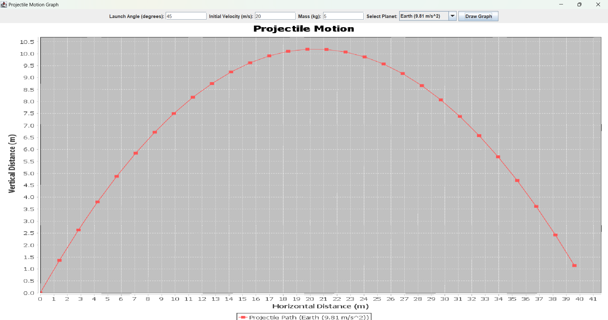

# Planetary Projectile Motion Graph 🚀

A graphical simulation of projectile motion considering different planetary gravities. Enter the **launch angle**, **initial velocity**, and **mass**, then select a planet to see how gravity affects the trajectory.

## Features ✨

- **Graphical Output**: Displays the projectile’s path on different planets.
- **Planets Supported**:
  - Earth (9.81 m/s²)
  - Moon (1.625 m/s²)
  - Mars (3.72076 m/s²)
  - All Planets (Simulate for all supported planets)

## Libraries Used 🔧

- **JFreeChart**: To create beautiful charts in Java.
- **Swing**: For creating the GUI.

## How to Use 📋

1. Clone the repository:
   ```bash
   git clone https://github.com/YourUsername/Planetary-Projectile-Motion-Graph.git

2. Compile the Java program:
   ```bash
    javac ProjectileMotionGraphSwing.java

3. Run the program:
   ```bash
    java ProjectileMotionGraphSwing


4. Enter the following parameters in the GUI:

  - Launch Angle (in degrees)
  - Initial Velocity (in m/s)
  - Mass (in kg)
  - Select a planet from the dropdown
  
5. Click on Draw Graph to visualize the projectile’s motion on the selected planet.

## Example 📝
1. Input 
   ```bash
      Launch Angle: 45 degrees
      Initial Velocity: 20 m/s
      Mass: 5 kg
      Planet: Earth
2. Output : A graph showing the projectile's path based on Earth's gravity.

## Screenshot 📸


